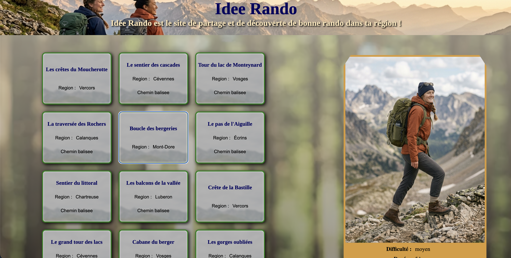

# Idée Rando

Petit catalogue de randonnées réalisé en React : on choisit une randonnée dans la liste et son détail s'affiche (difficulté, durée, dénivelé), avec une image et une couleur qui changent selon le niveau.

Projet individuel réalisé pendant ma formation à Ada Tech School (semaine 13), pour pratiquer les bases de React.



## Fonctionnalités

- Liste de 12 randonnées chargées depuis un fichier JSON
- Sélection d'une randonnée au clic, avec mise en évidence de la carte active
- Affichage du détail de la randonnée sélectionnée : difficulté, durée, dénivelé
- Image et couleur adaptées au niveau (facile, moyen, difficile)
- Indication « chemin balisé » affichée seulement quand c'est le cas

## Stack

- React 19
- Vite
- CSS (un fichier par composant)
- ESLint

## Lancer le projet

```bash
git clone git@github.com:Makibaypro/ideerando.git
cd ideerando
npm install
npm run dev
```

L'application est ensuite disponible à l'adresse indiquée dans le terminal (par défaut http://localhost:5173).

## Structure

```
data/randonnees.json   Données des randonnées
src/App.jsx            Composant racine, garde en état la randonnée sélectionnée
src/Card.jsx           Carte cliquable d'une randonnée
src/Picture.jsx        Détail de la randonnée sélectionnée
src/Entete.jsx         En-tête
src/Footer.jsx         Pied de page
```

## Ce que j'ai pratiqué

- Découper une interface en composants et leur passer des données par les props
- Gérer un état avec `useState` et le faire remonter d'un composant enfant vers son parent
- Afficher une liste avec `map` et l'attribut `key`
- L'affichage conditionnel en JSX

## Pistes d'amélioration

- Rendre la mise en page responsive (mobile)
- Ajouter un filtre par difficulté ou par région
- Remplacer les liens d'exemple du pied de page

## Crédits

Toutes les images de l'application ont été générées par IA.

## Auteur

Maxence Chotard
